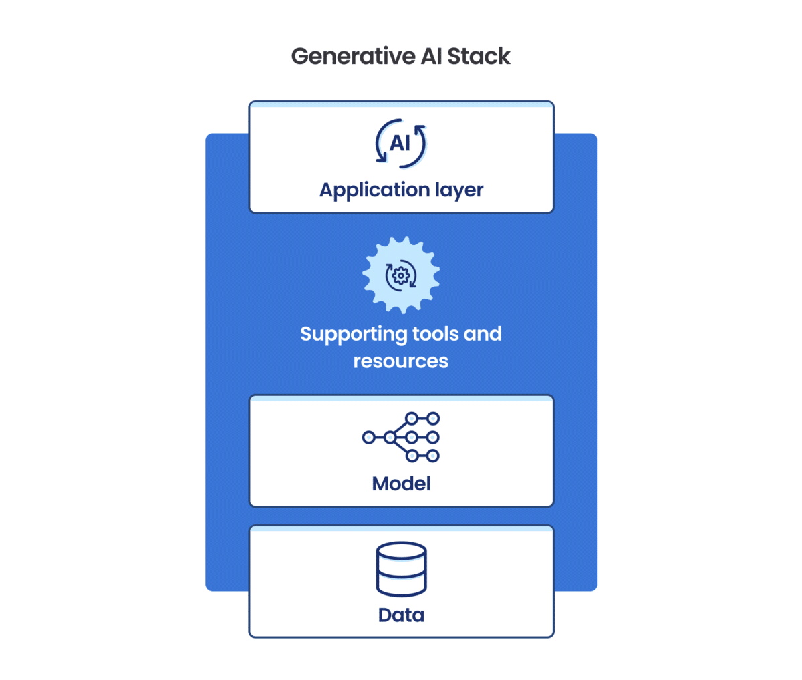

# Generative AI: AI-Powered Data Extraction and Content Retrieval with GenAI Stack from AI_Planet_Hub

## Overview

Welcome to the "AI-Powered Data Extraction and Content Retrieval with GenAI Stack" project by AI_Planet_Hub. This project leverages the power of Generative AI and GenAI Stack to create an intelligent system capable of extracting data from online sources and providing insightful answers to your questions. By combining state-of-the-art technologies, this project demonstrates the potential of AI in information management, chatbots, and knowledge retrieval systems.

## Table of Contents

- [Overview](#overview)
- [Table of Contents](#table-of-contents)
- [Project Description](#project-description)
- [Key Features](#key-features)
- [Technologies Used](#technologies-used)
- [Contacts](#Contacts)

## Project Description

The "AI-Powered Data Extraction and Content Retrieval" project aims to demonstrate the capabilities of GenAI Stack, a versatile framework for AI-based content retrieval and data extraction. The project incorporates various components to achieve its objectives, including:

- **Langchain ETL for Data Extraction:** Langchain ETL is employed for the extraction of data from online sources. This component enables the collection of information from websites and other digital platforms.

- **Hugging Face Embeddings for Natural Language Understanding:** To enhance the system's ability to understand and interpret natural language queries, the project integrates Hugging Face Embeddings. This component plays a vital role in converting human language into machine-understandable inputs.

- **Langchain Retriever for Content Retrieval:** The Langchain Retriever component is responsible for content retrieval. It facilitates the retrieval of relevant information based on user queries, making it valuable for answering questions and providing insights.

With these components working in harmony, the project's end product is a system that can effectively extract data from online sources and provide insightful answers to user questions.

## Key Features

1. **Data Extraction:** The project showcases data extraction capabilities, allowing you to extract valuable information from online platforms.

2. **Natural Language Understanding:** With the integration of Hugging Face Embeddings, the system can understand and interpret natural language questions and prompts.

3. **Content Retrieval:** The Langchain Retriever component enables content retrieval, making it invaluable for answering questions and providing insights.

4. **Versatility:** This project demonstrates the versatility of GenAI Stack and its potential in a wide range of applications, from chatbots to knowledge management systems.

## Technologies Used

- GenAI Stack
- Langchain ETL
- Hugging Face Embeddings
- Langchain Retriever
- OpenAI GPT-3.5

# Contacts
Follow me on Twitter 🐦, connect with me on LinkedIn 🔗, and check out my GitHub 🐙. You won't be disappointed!

👉 Twitter: https://twitter.com/NdiranguMuturi1  
👉 LinkedIn: https://www.linkedin.com/in/isaac-muturi-3b6b2b237  
👉 GitHub: https://github.com/Isaac-Ndirangu-Muturi-749  